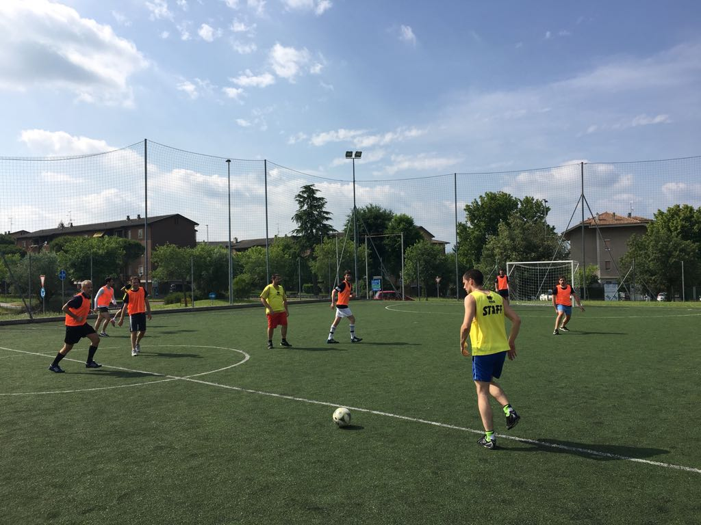

As a yearly tradition, **DatabizGroup**, holding group owner of **Bitrock**, celebrated a Corporate Event in the marvelous setting of the southern coast of the **Garda Lake** (Desenzano del Garda - BS). <!-- more -->

During this **2 days** Event, held at the exciting location of **Hotel Acquaviva** del Garda, the **3 souls of Databiz Group** met up together to review 1H - 2018 achievements and discuss about next strategical operations: **Databiz HoldingManagement** and **Staff**, **Bitrock's team** and **Radicalbit developers** had the opportunity to meet up and share mutual experiences, achievements, projects and targets.

A good opportunity to discover and explore the several natures of the group, understanding better the nature of **3 different companies** united by a single vision and distinguished by different missions. Greeted by a **group** breakfast, developers, managers and staff had the opportunity to encounter and discuss about mutual working activities and life experiences. New employees had the chance to meet new colleagues and better understand the group working and experience environment. Merging together different experiences and background is a relevant issue.

We are aiming to design a culture-centered working place, where diversity an peculiarity become together sources of valor.

---

## The Event | The moments of corporate experience

The first morning has been dedicated to **Corporate Speeches** and **Business reports**: opening act has been held by CEO **Leo Pillon**, who exposed in details 2018 group's vision, next steps and future evolution of the holding, consolidating a year of strong and radical evolutive transformations.

Following **CSO Lino Zagolin** exposed a detailed report of recent sales activities, including new scenarios in Academy, New Business and Partnerships. He also introduced to the team a new professional figure, **Luca Lanza**, Corporate Strategist and Business Developer. **COO Marco Veronese** took the stage in order to summarize to all employees the n**ew Bitrock's organization**, including the nomination of new **CTO Giampaolo Trapasso**, and new **Heads of** Practices: **Salvatore Laisa** (Head of Front End), **Marco Stefani** (Head of Back End), **Franco Geraci** (Head of DevOps), joining **Mirko Lazzarato** (Head of Think & Check IT), **Paola Casarsa** (Head of Make-UX) and **Riccardo Pessina** (Head of Operation Costs & Planning). He also introduced new Key Client **Daniele Bergo**.

On the second part of the morning **Michele Ridi** (Marketing and Sales Manager at Radicalbit) and **Roberto Bentivoglio** (CTO at Radicalbit), introduced a summary of activities of **Radicalbit**, Products and Services and Highlights of the first half of the year, also offering a sneak peek on new solutions.

Thereafter **Enrico Sala** (CFO Databiz Group) and **Cristina Del Vecchio** Head of Recruiting & Planning) entertained the audience with highly engaging analytics of the group, and exposed an emotional motivation session including corporate values and companies' missions.

Finally **Leo Pillon** closed the activities with an inspirational speech about the company long term vision, introducing the inner meaning of the company's claim **#lookbeyond**, defining himself first of all a dreamer committed to achieve great results.

Time for serious things ended. After a brunch all together all staff dedicated to games, water and fun.

Unmissable a **football match**... After all we are an Italian company. While someone was standing in the Sauna and Hammam, other braves were disputing a deathmatch under the sun.

And then a little surprise. A **Special Guest** introduced guests to the way of determination, proactivity and team vision. Straight from his glorious sporting experience: the great (and tall!) **Riccardo Pittis**, renowned basket champion, held a strong and effective speech about loosing and win, team and group, responsibilities and changement.

Finally hen the light went down, a long night dinner, open bar and music brought the guests through the late night.