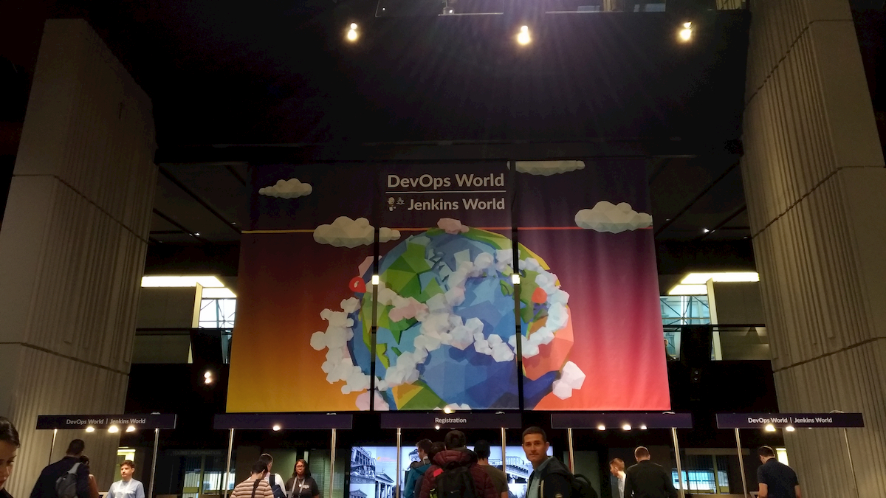
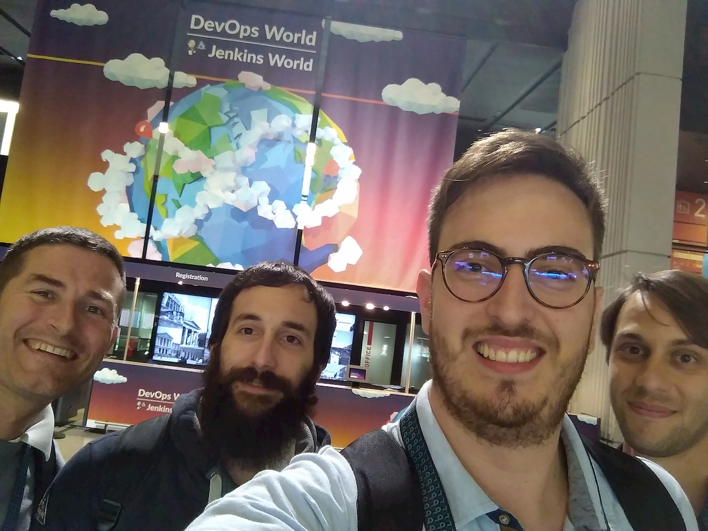
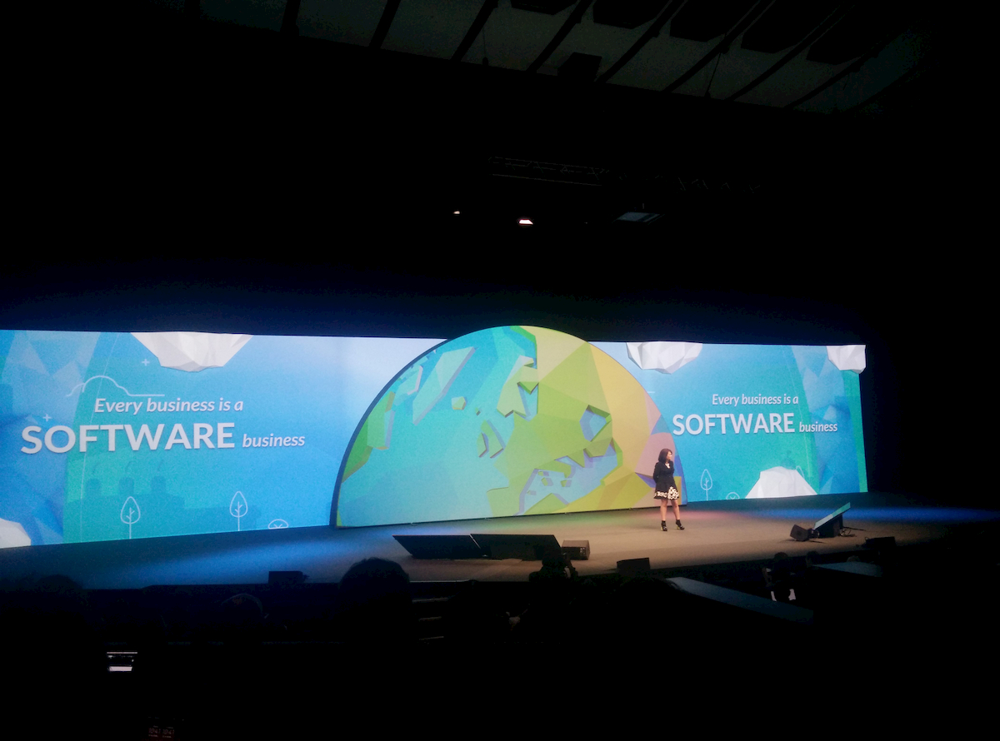

Jenkins World brings together the DevOps community in two locations, providing opportunities to learn, explore, network and help shape the future of DevOps and Jenkins. <!-- more --> DevOps World | Jenkins World is designed specifically for IT executives, DevOps practitioners, Jenkins users and partners. 

*Nice, France | Palace of Congresses and Exhibitions Nice Acropolis
October 22-25*

2,500 attendees will attend this year, from all over the globe. They'll get access to 100+ workshops, training opportunities and sessions covering software automation, DevOps culture, performance measurement, security and more.

Bitrock is present with **Matteo Gazzetta**, **Simone Ripamonti**, and **Andrea Simonini**, members of **Bitrock's DevOps Team**. But not only DevOps are attending... Our Backend Developer **Simone Esposito** is attending too.

Discover more about the event at: 

*Our Team at the Event*

[https://www.cloudbees.com/devops-world/nice](https://www.cloudbees.com/devops-world/nice)

*Nice, France | Palace of Congresses and Exhibitions Nice Acropolis October 22-25*