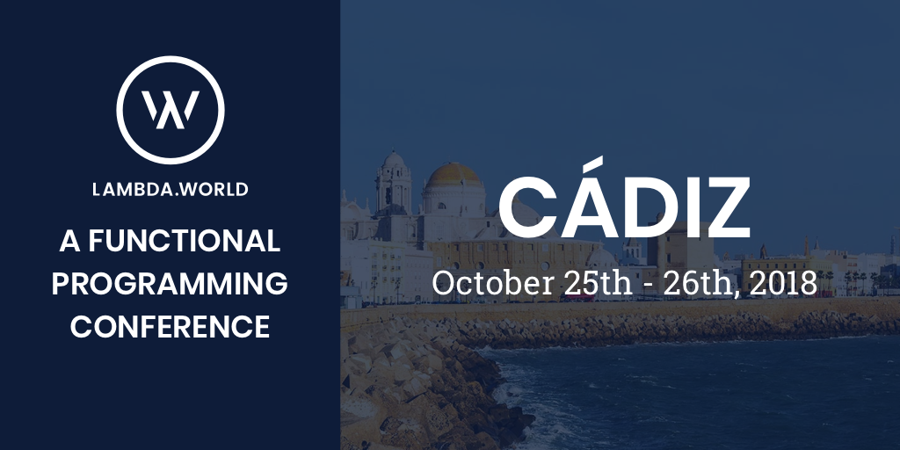
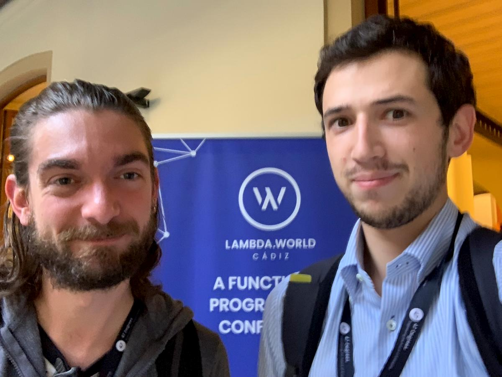

Lambda World is the largest **Functional programming event** in the country, carefully crafted for you by 47 Degrees and the Scala and Java communities of Spain. <!-- more --> The event takes place in Cádiz, one of the most beautiful cities in Spain, and includes Workshops, hands-on experience, hacking, and debugging.

Our colleagues **Andrea Bessi** and **Alberto Adami** will be our representatives in Spain.

_Andrea Bessi & Alberto Adami at Lambda World_

Discover the Full Event Agenda at: [http://cadiz.lambda.world/schedule/](http://cadiz.lambda.world/schedule/)