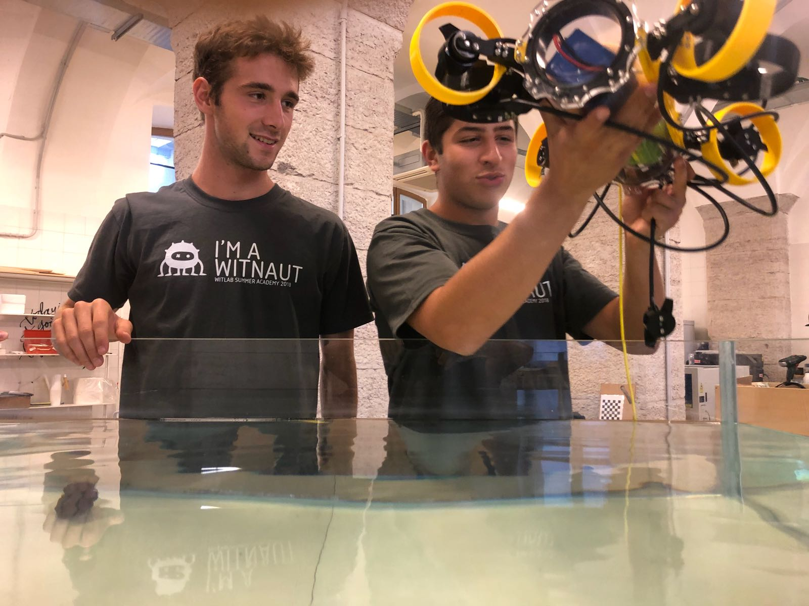
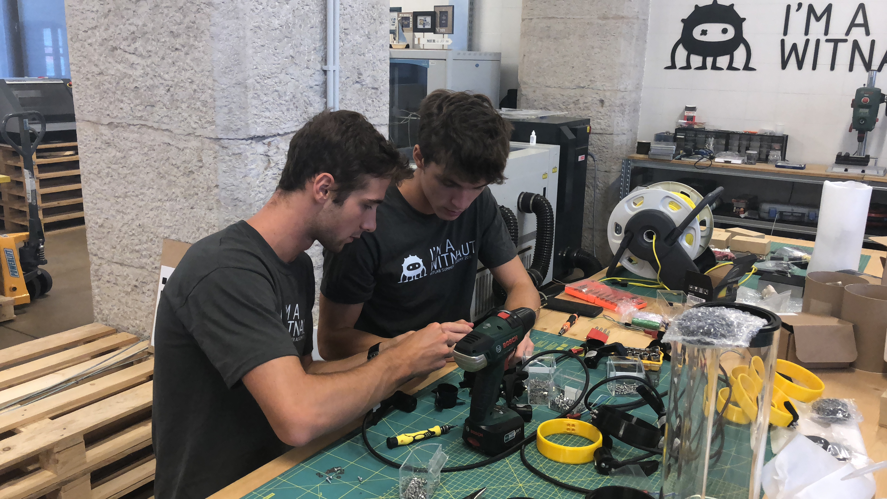

Treviso, September 4, 2018 - BITROCK, supports the Space Lions, five students from Treviso between 17 and 18 years, that last January  won the prestigious NASA Challenge "Zero Robotics" with a computer code for the asteroids coring. <!-- more --> Together with the robotics startup Witted, during the WitLab Summer Academy, alongside the software, the five young talents are developing, with the support of BITROCK, a hardware prototype able to autonomously explore the depths of the seas and lakes.

_The students in action with their prototype_

"We are a company that has made of innovation its own mission and we firmly believes in talents. For this reason we are encouraging these young talents, supporting them in this experience, and we are willing do it, within the limits of our possibilities, every time there will be smart boys and girls "says Leo Pillon, CEO of BITROCK".

Helping and supporting 5 young talents, who are now preparing to go "from theory to practice", means for us to relive and revitalize the values ​​of our company, nourishing them with new energy day by day, thus making it possible to transform dreams into reality, under the guidance of research and passion".

_Building up the prototype_

Such as for these five students, the path of BITROCK has in a certain sense just begun. "We have always been one step ahead, moving on to unexplored territories and tightening avant-garde partnerships with pioneering technology companies: today we are premier partners of Lightbend and Confluent, and this meticulous path has led us to be among the major players in the training field, certified on these technologies, through our Bitrock Academy ", concludes Leo Pillon.

_The full team of **Space Lions** at **Witted**, during the **WitLab Summer Academy**._

Read more at ANSA:
[http://www.ansa.it/industry_4_0/notizie/postit/2018/09/05/bitrock-punta-su-giovani-geni-della-robotica_7e391e61-4a59-4385-b9fb-7f6ef4b4ca47.html](http://www.ansa.it/industry_4_0/notizie/postit/2018/09/05/bitrock-punta-su-giovani-geni-della-robotica_7e391e61-4a59-4385-b9fb-7f6ef4b4ca47.html)