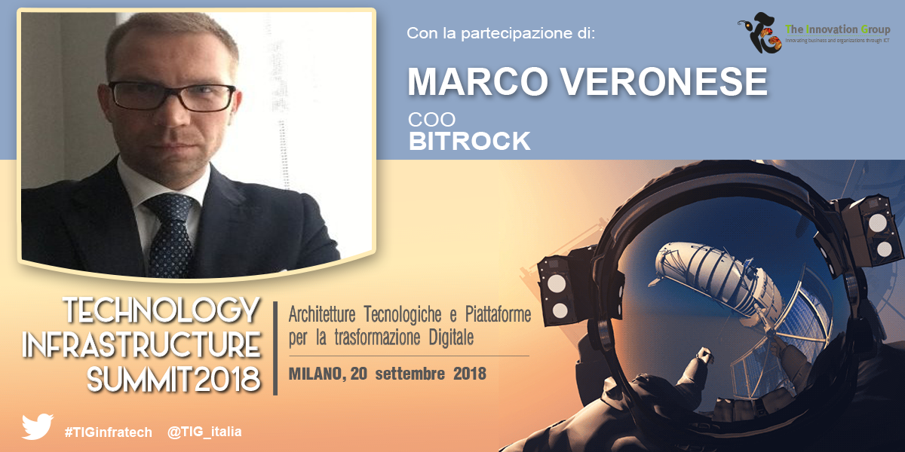

Addressing the issue of digital transformation often means to focus on the application areas and the business impacts of technologies and digital solutions: performance management, customer experience, the evolution of enterprise  business models are just some of the recurring themes under the broader hat of digital transformation. <!-- more -->

On the other hand, flexibility, performance, scalability and responsiveness are the elements that are increasingly essential in a modern and digital-ready infrastructure: being able to adapt and face the challenges of the business becomes the founding condition of every IT infrastructure in an overall digital transformation strategy.

Hybrid Cloud architectures, software-defined data centers, edge computing, containers and microservices, serverless technology, infrastructure-as-a-code, robotic process automation (RPA), API-based architectures, new processes of Agile development and integration with IT operations such as DevOps and the new risks related to security are just some of the issues concerning the evolution and planning of the future of the ICT infrastructure of companies.

In September 20th, Bitrock is platinum sponsor of **Technology Infrastructure Summit 2018**, and **Marco Veronese** (COO) will talk about:

**"AGILE ARCHITECTURE & AGILE OPERATIONS"** | The evolution of IT architectures towards agile and innovative models - Introducing Microservices, Containers, Open API and DevOps processes.

Also invited Speakers:
* Massimiliano Pianciamore, Head of Distributed Architectures Competence Center, CEFRIEL 
* Mirko De Dominicis, ‎IT Manager, Rewe Group – Penny Market Italia 
* Giovanni Daprà, Co-Founder & CEO, Moneyfarm 

[#TIGinfratech](https://www.linkedin.com/feed/topic/?keywords=%23TIGinfratech)